# Brain Tumor Detector

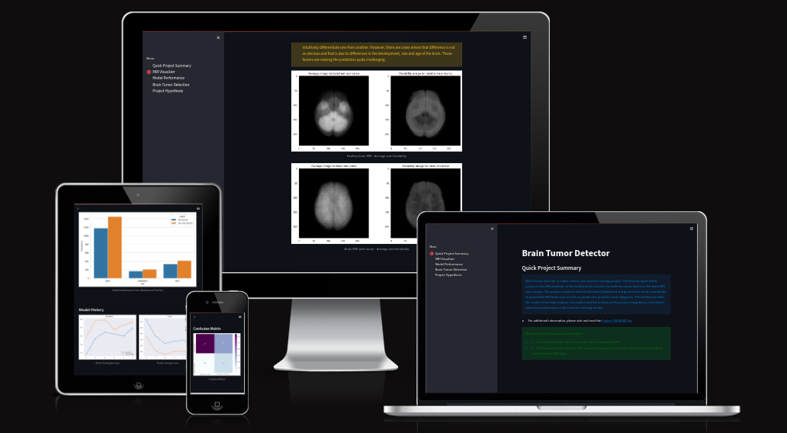

Brain Tumor Detector is a data science and machine learning project that is the 5th and final Project of the Code Institute's Bootcamp in Full Stack Software Development with specialization in Predictive Analytics.
The business goal of this project is the differentiation of the healthy brain and the one with the tumor based on the brain MRI scan images. The project is realised with the [Streamlit Dashboard](https://brain-tumor-detector-e5d30222dbc4.herokuapp.com/) and gives to the client a possibility to upload the MRI brain scan in order to predict the possible tumor diagnosis. The dashboard offers the results of the data analysis, description and the analysis of the project's hypothesis, and details about the performance of the machine learning model.
The project includes a series of Jupyter Notebooks that represent a pipeline that includes: importation and cleaning  of the data, data visualization, development and evaluation of the deep learning model.

## Table of Contents
1. [Dataset Content](#dataset-content)
2. [Business Requirements](#business-requirements)
3. [Hypothesis and how to validate?](#hypothesis-and-how-to-validate)
4. [The rationale to map the business requirements to the Data Visualizations and ML tasks](#the-rationale-to-map-the-business-requirements-to-the-data-visualizations-and-ml-tasks)
5. [ML Business Case](#ml-business-case)
6. [ML Model Development](#ml-model-development)
   1. [Version 1](#version-1)
   2. [Version 2](#version-2)
   3. [Version 3](#version-3)
   4. [Version 4](#version-4)
7. [Hypotheses - Considerations and Validations](#hypotheses---considerations-and-validations)
8. [Dashboard Design](#dashboard-design)
9.  [Unfixed Bugs](#unfixed-bugs)
10. [Deployment](#deployment)
11. [Main Data Analysis and Machine Learning Libraries](#main-data-analysis-and-machine-learning-libraries)
12. [Other technologies used](#other-technologies-used)
13. [Issues](#issues)
14. [TESTING](#testing)
    1.  [Manual Testing](#manual-testing)
        1.  [User Story Testing](#user-story-testing)
    2. [Validation](#validation)
    3. [Automated Unit Tests](#automated-unit-tests)
15. [Credits](#credits)
    1.  [Content](#content)
16. [Acknowledgements](#acknowledgements)

## Dataset Content
The dataset is **Brain Tumor** dataset from [Kaggle](https://www.kaggle.com/datasets/jakeshbohaju/brain-tumor/data)

This is a brain tumor feature dataset including five first-order features and eight texture features with the target level (in the column Class).

- First Order Features
    - Mean
    - Variance
    - Standard Deviation
    - Skewness
    - Kurtosis

- Second Order Features
    - Contrast
    - Energy
    - ASM (Angular second moment)
    - Entropy
    - Homogeneity
    - Dissimilarity
    - Correlation
    - Coarseness 

Image column defines image name and Class column defines either the image has tumor or not (1 = Tumor, 0 = Non-Tumor)

[Back to top ⇧](#table-of-contents)

## Business Requirements
The primary objective of this project is to develop a machine learning model for the early detection of brain tumors from medical images. The model should assist medical professionals in making quicker and more accurate diagnoses, and the patients should benefit from the earlier detection and the tempestive and appropriate treatment planning.

Key Stakeholders, therefore should be:
    - Medical professionals
    - Patients
    - Hospitals and healthcare facilities

Requirements:

- Accuracy: The model should have a high accuracy rate in classifying brain images as either tumor (1) or non-tumor (0).
- Interpretability: The model should provide some insight into the prediction process and the relevant feature importance in that process, so the medical professionals could understand the relevant discoveries.
- Scalability: The solution should be scalable to handle a large volume of brain images from various sources.
- Speed: The model should be able to make predictions in real-time so that the reliable quick diagnosis could be make.
- Privacy: The meticulous attention should be given in the data collection in order to guarantee the patient's anonymity and consent for the data usage.

In short, the project businsess objectives are as follows:
1. The client is interested in having an analysis of the visual difference between the MRI brain scan of healthy and brain with tumor. The analysis should provide, among other things: the average image and variability per label in the data set.
2. The client is interested in having a functional and reliable ML model that could predict the presence or absence of the tumor from the image of the MRI brain scan. For the realisation of this business objective, a deep learning pipeline should be developed with the binary classification of the MRI images. The said pipeline should be also deployed.
- The Streamlit Dashboard will be developed that will finally serve as a platform for the presentation of the results of first two business objectives, together with the interactive implementation of the prediction of the unseen MRI image.

[Back to top ⇧](#table-of-contents)

## Hypothesis and how to validate?

The project's initial hypotheses were for each business objective as follows:

1. There's a strong conviction that there could be a way to visually observe and notice the difference in brain MRI scans between a healthy brain and the one with the tumor. Being in low resolution, the filtering of the MRI scans and the comparison between the average scan of the tumor and the healthy brain scan should show the visible shade difference.
2. The deep learning model with convolutional neural network (CNN) architecture should be able to accurately classify the unseen data of the brain MRI images as tumor or non-tumor. Data augmentation techniques will help improve model generalization.

- The validation of these hypotheses should be made through the graphical evaluation of the generated model, and through the testing. The model should include the validation of its accuracy and loss between epochs, and finally through a confusion matrix.
- Upon the validation of these two hypotheses, the client should be able to use the conventional image data analysis and the ML model of this project in order to differentiate with high accuracy the presence or not of the tumor by the means of the brain MRI scan.

[Back to top ⇧](#table-of-contents)

## The rationale to map the business requirements to the Data Visualizations and ML tasks

- Accuracy: Visualizations should make the model's performance metrics comprehensible. We will plot learning curves to monitor training progress and use confusion matrices for a detailed breakdown of classification results.
- Interpretability: Visualizations will provide insight into how the model is making predictions. It is aligned with the interpretability requirement.
- Scalability: We will analyze the model's performance on varying sizes of datasets using visualizations to ensure it scales efficiently.
- Speed: Monitoring the model's inference time will ensure it meets the speed requirement.
- Privacy: This will be ensured through data anonymization, which will be part of the data handling and model deployment processes.

**Business Requirement 1: Data Visualization**
- As a client, I can navigate easily through an interactive dashboard so that I can view and understand the data.
- As a client, I can view visual graphs of average images,image differences and variabilities between MRI of a healthy brain and the one of the tumor, so that I can identify which is which more easily.
- As a client, I can view an image montage of the MRI's of the healthy brain and the one with tumor, so I can make the visual differentiation.

**Business Requirement 2: Classification**
- As a client, I can upload image(s) of the brain MRI scans to the dashboard so that I can run the ML model and an immediate accurate prediction of the posible brain tumor.
- As a client, I can save model predictions in a timestamped CSV file so that I can have a documented history of the made predictions.

[Back to top ⇧](#table-of-contents)

## ML Business Case

- The client is focused on accurately predicting from a given medical image whether a brain tumor is present. This business objective will be achieved through the development and deployment of a TensorFlow deep learning pipeline, trained on a dataset of brain images classified as either having a tumor or not.
- This TensorFlow pipeline will employ a convolutional neural network (CNN), a type of neural network particularly effective at identifying patterns and key features in image data, utilizing convolution and pooling layer pairs.
- The ultimate goal of this machine learning pipeline is a binary classification model. The desired outcome is a model capable of successfully distinguishing brain images as either having a tumor or being tumor-free.
- The model's output will be a classification label indicating the presence or absence of a brain tumor, based on the probability calculated by the model.
- Upon generating the outcome, the following heuristic will be applied: Brain images identified as having a tumor will be flagged for further medical review and potential treatment planning, while those classified as tumor-free may undergo additional checks as per medical protocols.
- The primary metrics for evaluating the success of this machine learning model will be overall model accuracy (measured by the F1 score) and recall for correctly identifying brain images with tumors.
- The reasonable accuracy threshold shoud be set very high by the stakeholder, but the dataset provided could be quite limiting. A model with high accuracy will be crucial in ensuring reliable diagnoses, thereby improving patient outcomes and optimizing the use of medical resources.
- High recall in detecting brain tumors is critical, as the cost of not identifying a present tumor (false negatives) is significantly higher than incorrectly identifying a tumor in a healthy brain (false positives). The preliminary threshold for recall should be also reasonabely high, but the dataset could be a limiting factor.
- Therefore, a successful model for this project is one that achieves an F1 score of 0.95 or higher and a recall rate for detecting brain tumors of 0.98 or higher, aligning with the critical nature of accurate and reliable medical diagnoses.

[Back to top ⇧](#table-of-contents)


## ML Model Development

The ML model is a Convolutional Neural Network (CNN) built using Keras, a high-level neural networks API. This model is designed for binary classification tasks, as indicated by the use of the sigmoid activation function in the output layer and the binary crossentropy loss function. Here's a breakdown of its architecture:

### Version 1
There are three convolutional layers, each followed by a max pooling layer. These are used for feature extraction from the input images. Each convolutional layer is followed by a max pooling layer with a pool size of 2x2, which reduces the spatial dimensions of the output.After the convolutional and pooling layers, the model flattens the output to convert it into a one-dimensional array. This is necessary for feeding into the dense layers for classification.

Dense Layers:
The first dense layer has 128 neurons and uses 'relu' activation. It serves as a fully connected layer that processes features extracted by the convolutional layers. This is followed by a dropout layer with a dropout rate of 0.5 to reduce overfitting by randomly setting input units to 0 during training. The final dense layer has 1 neuron with a 'sigmoid' activation function. This is suitable for binary classification, producing a probability output indicating the likelihood of belonging to one of the two classes.

Compilation:
The model uses the 'adam' optimizer, a popular choice for deep learning models due to its efficiency. The loss function is 'binary_crossentropy', which is standard for binary classification problems. The model seemed well-suited for tasks like image-based binary classification, which could include applications such as distinguishing between two different types of objects or conditions in images.
Unfortunatelly, the evaluation of the model didn't give a desired output. 

<details>
<summary>These are the results for the V1:</summary>

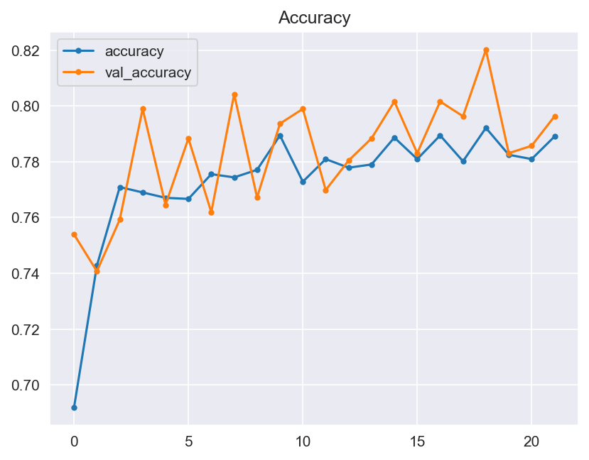
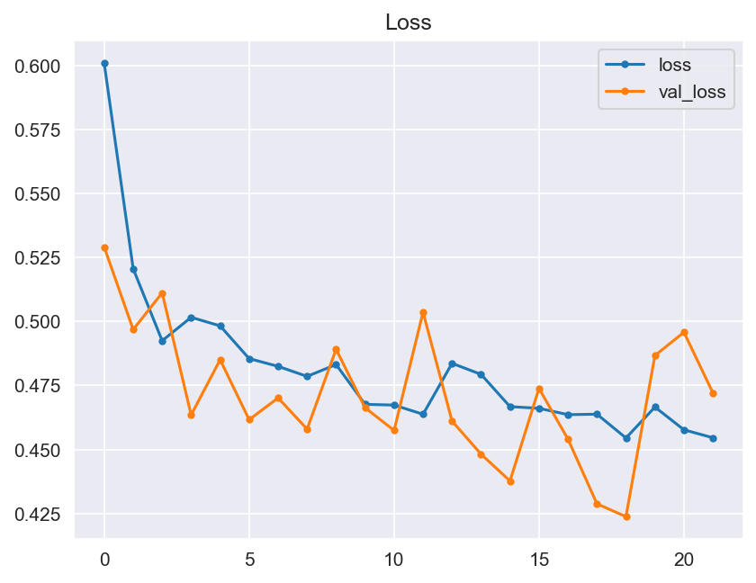
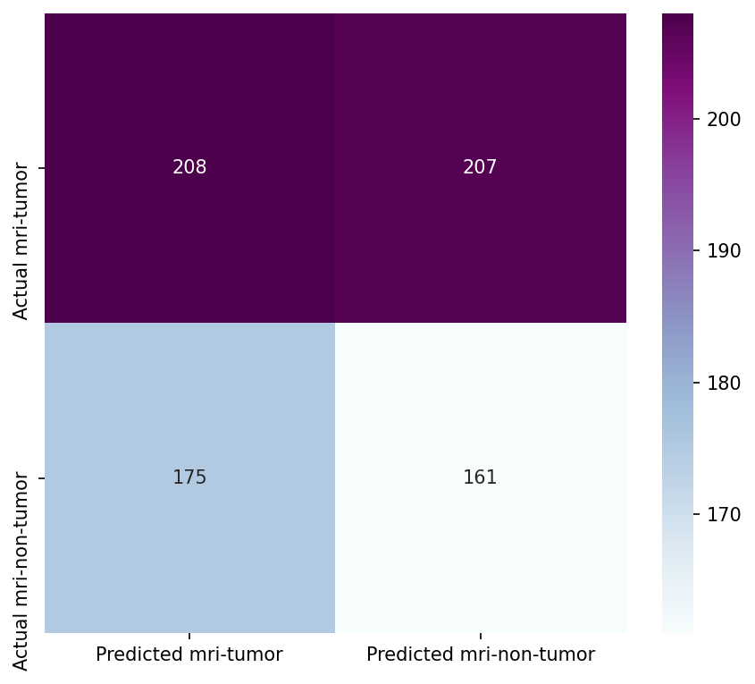

</details>

### Version 2
The improved and advanced setup for the build_model function now takes hyperparameters as argument. The hyperparameters are the number of convolution layers, number of filters, number of units in dense layer, dropout rate, learning rate of optimizer, etc.
The number of units in the dense layer can range from 32-512, and the dropout layer rate can be adjusted from 0.0-0.5. The output layer settings and compilation settings of the model are similar to those of the previous model.
The hyperparameter tuning with RandomSearch is optimizing the model. The tuner will try different hyperparameter settings over a set number of times to find the optimal configuration for the task. The goal is to maximize the validation accuracy of the model. The class weights calculation is used to deal with class imbalance in training data. This is especially useful for medical imaging datasets such as MRI scans, as one class can be heavily underrepresented. By tuning the hyperparameter, the model will be able to perform better on the specific set of MRI images.
The model, although improved, didn't give the wanted results.

<details>
<summary>These are the results for the V2:</summary>

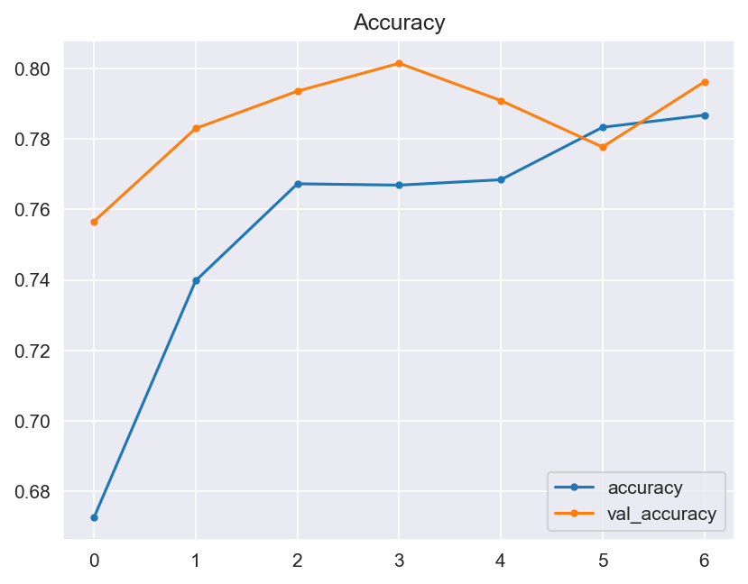

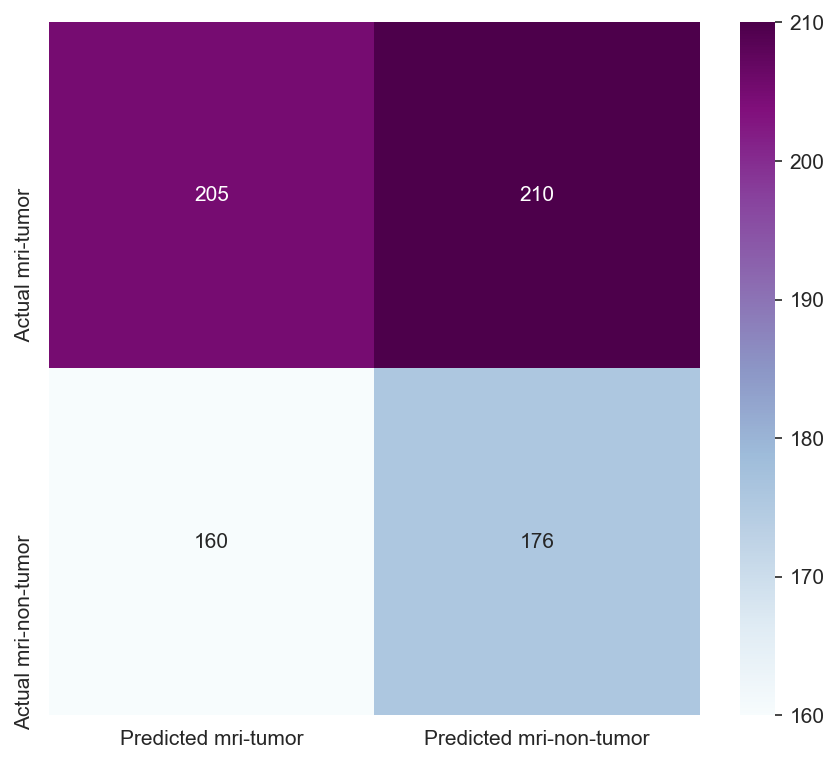

</details>

### Version 3
The improvements are made in different tweaking model tuning.To find the best combination of hyperparameters, we use again the RandomSearch tuner. It randomly samples from the defined hyperparameter space and evaluates each configuration based on validation accuracy. The tuner performs a maximum of 10 trials, with 2 training runs per trial. This helps us explore a variety of hyperparameter configurations.
The tuner trains the model with different hyperparameter configurations and evaluates each one on the validation set. It uses class weights and includes early stopping for efficiency.
After the search, we retrieve the best hyperparameters and rebuild the model using those optimal settings. We print the optimal number of units in the dense layer and the learning rate for the optimizer.
Again, this model didn't give the wanted results. There was one issue with the saved model - it gave an error upon loading. Since the training time was quite long, the new approach was decided.

<details>
<summary>These are the results for the V3:</summary>

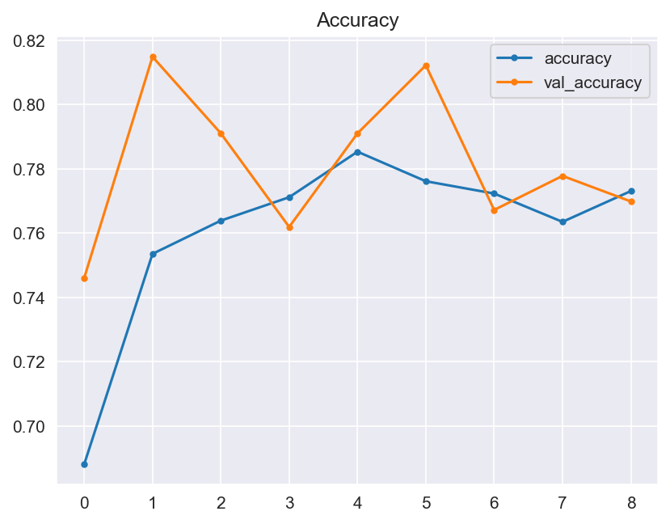
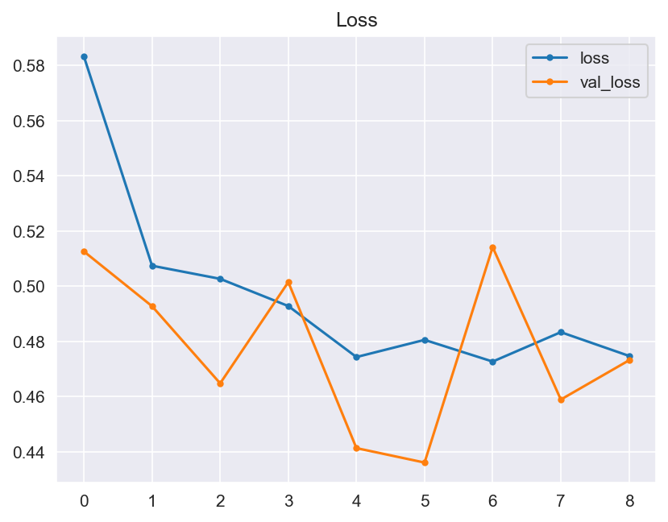
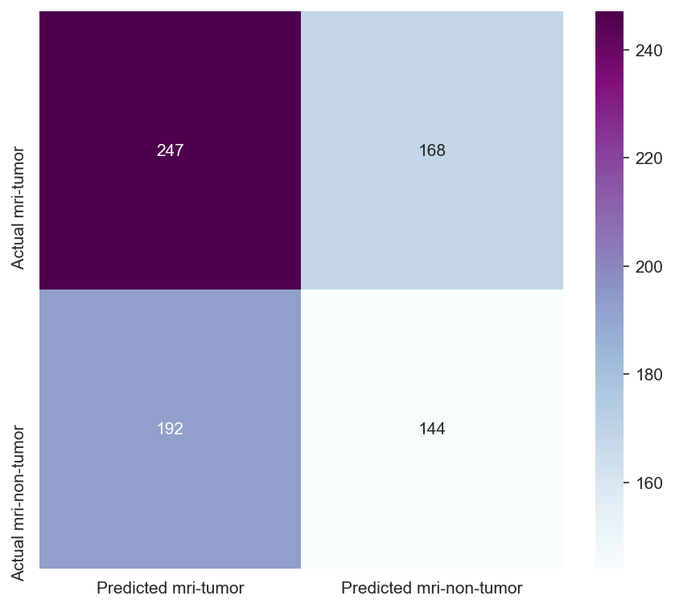

</details>

### Version 4
Several key improvements and changes compared to the previous model and hyperparameter tuning setup. Let's break down these updates:
The architecture remains largely similar with three convolutional layers, each followed by a max pooling layer. However, the filters in the third convolutional layer are consistent with the second (both have 64 filters), unlike the previous version where the third layer had 128 filters. This consistency can help in reducing model complexity while still capturing essential features.

The number of units in the dense layer remains as a tunable hyperparameter, allowing the model to experiment with different complexities in the fully connected part of the network. The learning rate of the optimizer is now a hyperparameter, allowing the model to find the optimal rate for training.

Tuner Type - Hyperband: The most significant change is the switch from RandomSearch to Hyperband for hyperparameter tuning. Hyperband is an optimized version of random search with early stopping. It's more efficient because it quickly identifies the most promising hyperparameters by iteratively training a large number of models for a few epochs and only continuing with the best-performing ones.

Max Epochs and Factor: The Hyperband tuner introduces max_epochs and factor parameters, which control the number of epochs for each trial and the downsampling rate of models, respectively.

The project name has been changed to 'mri_tumor_tuning'.
Training with Best Hyperparameters: After the hyperparameter search, the model is trained with the best-found hyperparameters over 25 epochs, similarly to the previous setup. The verbose level in model training is set to 1 (previously was 2 in the tuning phase).

Overall Improvements:
By employing the Hyperband tuner, the process of finding the best hyperparameters becomes more efficient and potentially more effective, especially in cases with limited computational resources. The model might be slightly simpler and more consistent, potentially improving generalization and reducing the risk of overfitting.
The tuning now specifically targets the dense layer units and learning rate, which are critical factors in the model's performance. These changes indicate a thoughtful iteration on the model's design and tuning process, aiming to optimize performance, particularly for a potentially complex task like MRI tumor detection.

Though the consistency of the Accuracy and Loss is improved, the Confusion Matrix shows that the model didn't improve much and its score doesn't satisfy the Business requirements.

<details>
<summary>These are the results for the V4:</summary>

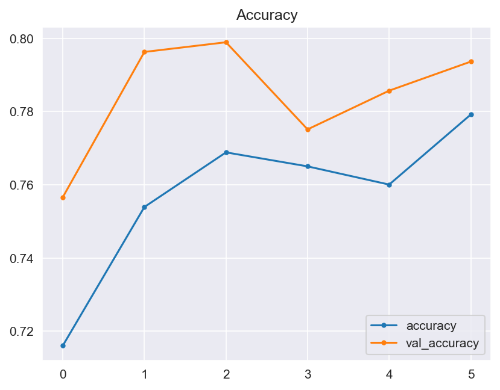
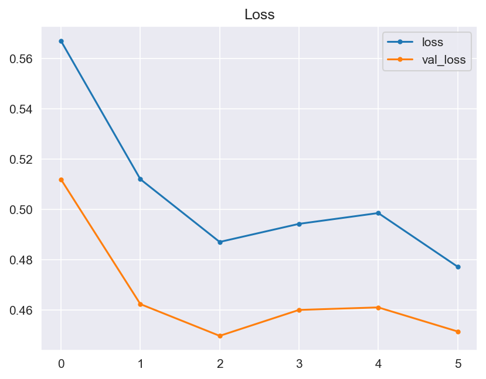
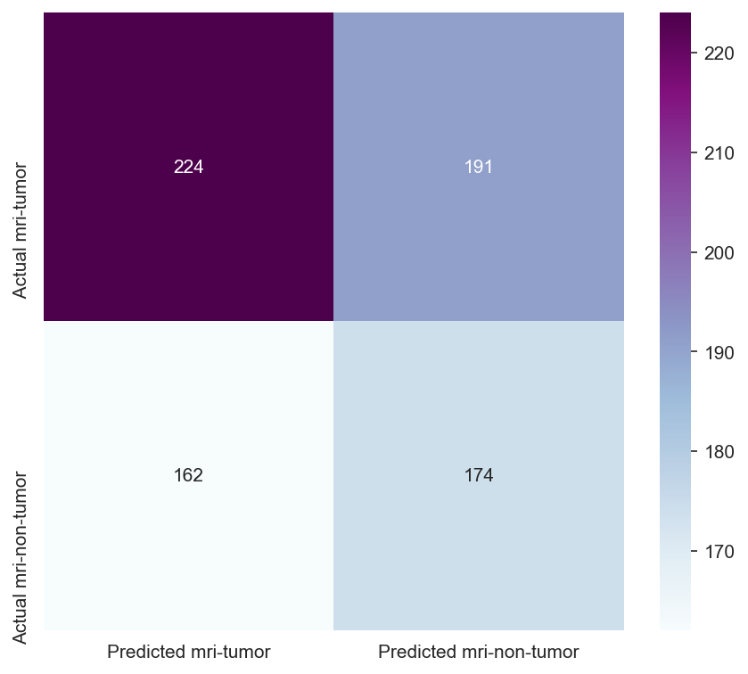

</details>

<br>

[Back to top ⇧](#table-of-contents)

## Hypotheses - Considerations and Validations

The initial hypotheses for the project, centered around the potential of machine learning (ML) in analyzing brain MRI scans, were as follows:

1. **Visual Differentiation Hypothesis:** It was strongly believed that differences between healthy brains and those with tumors could be visually discerned in MRI scans. Even with low-resolution images, it was hypothesized that filtering and comparing the average tumor scan against a healthy brain scan would reveal distinguishable shade differences.

2. **Deep Learning Classification Hypothesis:** A deep learning model, particularly one using a convolutional neural network (CNN) architecture, was expected to accurately classify brain MRI images as either having a tumor or not. The use of data augmentation techniques was anticipated to enhance the model's ability to generalize.

The validation process for these hypotheses involved:

- Graphical evaluation of the model's performance, including monitoring accuracy and loss across training epochs.
- Testing the model's effectiveness through the use of a confusion matrix.

However, upon validation, the ML model faced challenges:

1. **Ambiguity in Visual Differentiation:** In instances where the difference between healthy and tumor-affected scans wasn't pronounced, the model struggled to make accurate distinctions.

2. **Insufficient Performance Metrics:** The accuracy and F1 scores of the model did not meet the predefined thresholds, indicating that the model was not yet ready for approval in its current state.

As a result, while the project showed promise, further refinement and testing of the ML model are necessary to achieve the desired level of accuracy in differentiating between healthy and tumor-affected brain MRI scans.

One of the conclusions is that the dataset for the project didn't contain enough data to build a solid ML model. The MRI images were only of the axial view (top view) of the brain, whilst the other views (saggital, coronal and back view) were missing. I believe that with complete data, the ML model would have a greater success.

[Back to top ⇧](#table-of-contents)

## Dashboard Design

- This project is presented through a Streamlit dashboard web application that consists of five app pages. The client can effortlessly navigate through these pages using the interactive menu located on the left side of the page, as depicted below.
- **Quick Project Summary** - The homepage of the project provides a fundamental overview of the business process that motivates the creation of this project, in addition to providing links to additional documentation.

<details>
<summary>Quick Project Summary</summary>

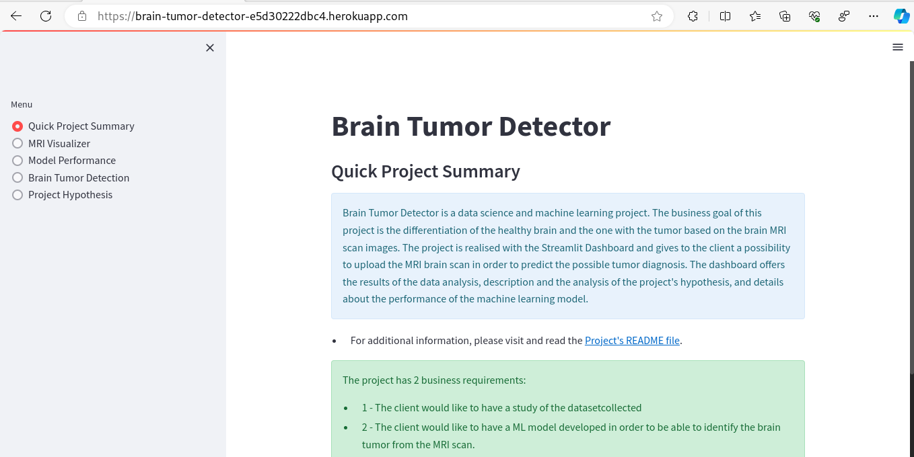
</details>
<br>

- **MRI Visualizer** - The first business objective of the project is addressed by the MRI Visualizer page, which focuses on Data Analysis. This page includes plots that can be toggled on and off using the built-in toolbar. Examples of these plots are provided below.

<details>
<summary>MRI Visualizer</summary>

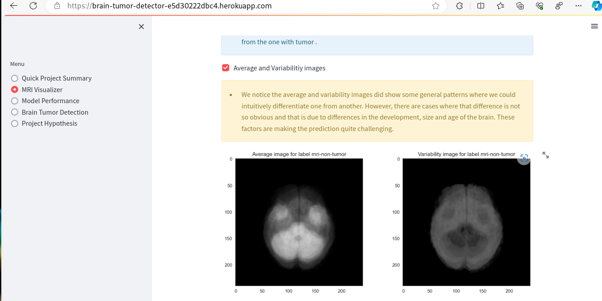
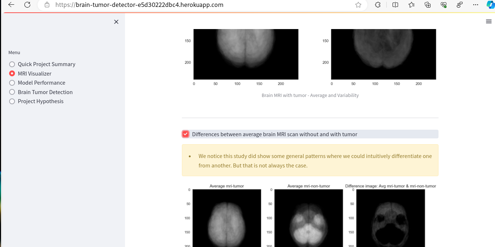
</details>

* Additionally, this app page offers a tool for creating image montages. Users can select a label class (tumor or non-tumor) and view a montage generated through graphical presentation of random validation set images.

<details>
<summary>Montage</summary>

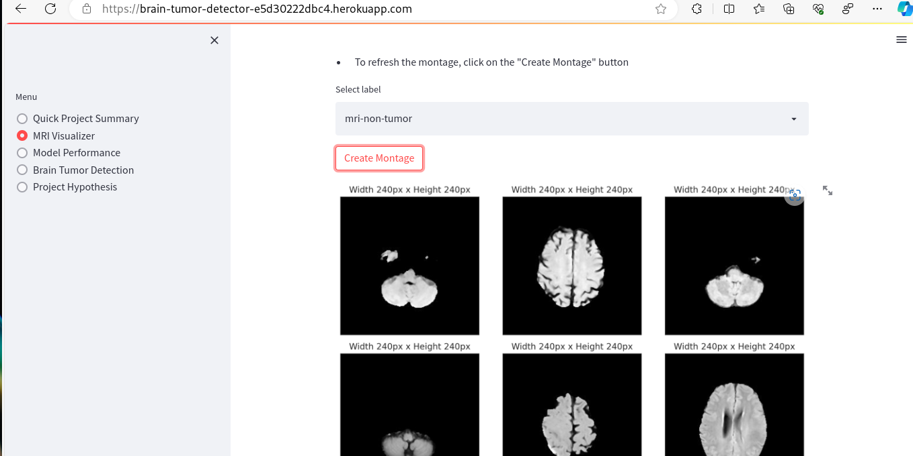
</details>
<br>

- **Model Performance** - The dataset size and label frequencies, which indicate the initial imbalance of the target, are documented on this page. Additionally, the history and evaluation of the project's machine learning model are provided. The paired graphs display the validation loss and accuracy per epoch, showcasing the model's progress over time. Furthermore, a confusion matrix illustrating the predicted and actual outcomes for the test set is presented.

<details>
<summary>Model Performance</summary>

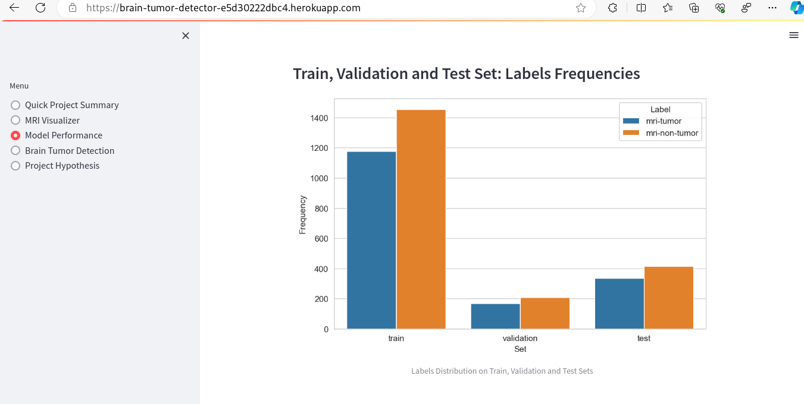
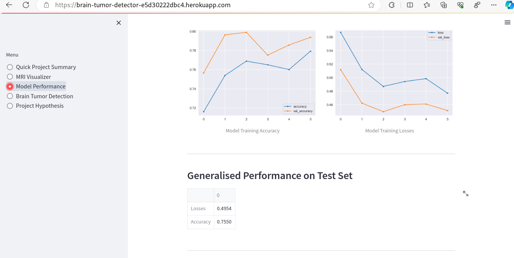
</details>
<br>

- **Brain Tumor Detection** - tool fulfills the second ML business objective of the project. It provides access to the original raw dataset, allowing users to download MRI brain scans. These images can then be uploaded to receive a class prediction output generated by the model.

<details>
<summary>Brain Tumor Detection</summary>

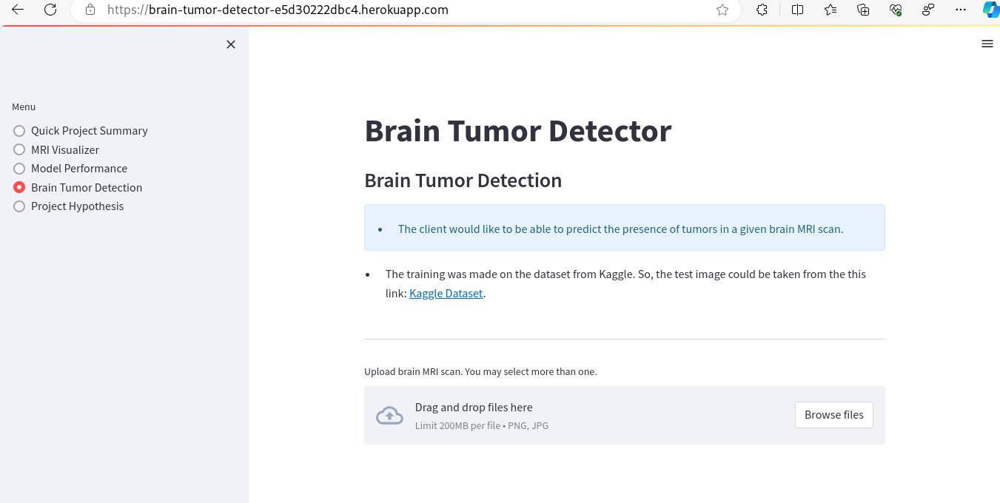
</details>
<br>

- Here are some examples of the outputs, namely, a binary class prediction, a graphical representation showing percentages, and the option to download the output DataFrame as a CSV file.

<details>
<summary>Brain Tumor Detection Outputs</summary>

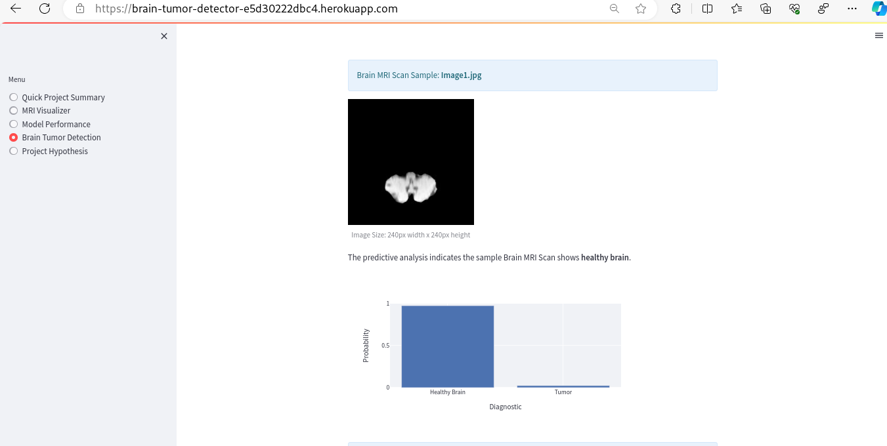
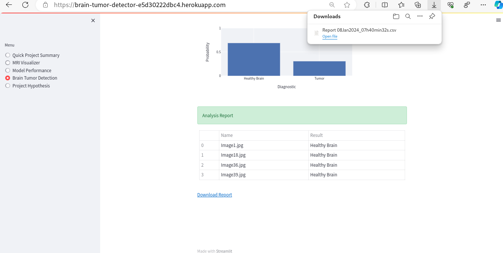
</details>
<br>

- **Project Hypothesis**
This application page showcases written documentation of the project's hypotheses and analysis of the findings, demonstrating their alignment with the aforementioned hypotheses. The contents is similar to the one in this documentation.

<details>
<summary>Project Hypothesis</summary>

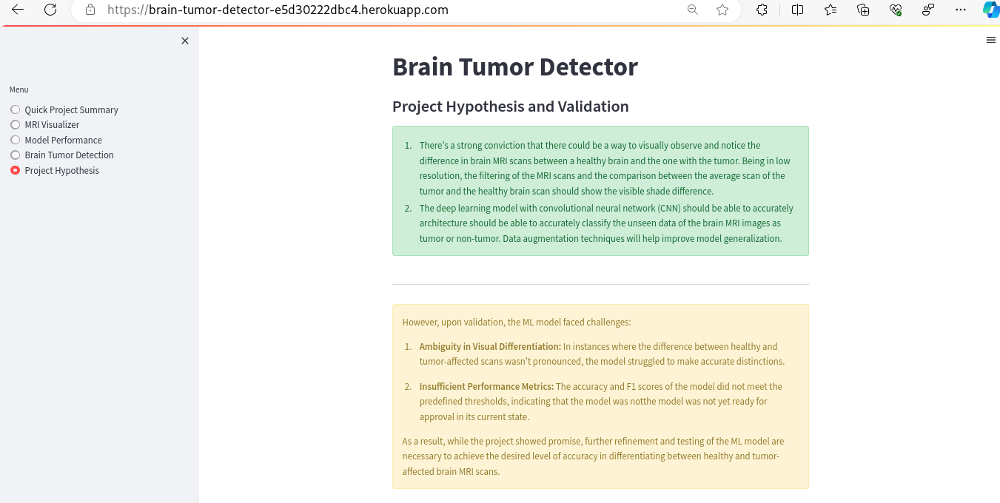
</details>
<br>

[Back to top ⇧](#table-of-contents)

## Unfixed Bugs
* There are no unfixed bugs.

## Deployment
### Heroku

* The App live link is: [https://brain-tumor-detector-e5d30222dbc4.herokuapp.com/](https://brain-tumor-detector-e5d30222dbc4.herokuapp.com/)
* Set the runtime.txt Python version to a [Heroku-20](https://devcenter.heroku.com/articles/python-support#supported-runtimes) stack currently supported version.
* The project was deployed to Heroku using the following steps.

1. Log in to Heroku and create an App
2. Log into Heroku CLI in IDE workspace terminal using the bash command: *heroku login -i* and enter user credentials
3. Run the command *git init* to re-initialise the Git repository
4. Run the command *heroku git:remote -a "YOUR_APP_NAME"* to connect the workspace and your previously created Heroku app.
5. Set the app's stack to heroku-20 using the bash command: *heroku stack:set heroku-20* for compatibility with the Python 3.8.14 version used for this project
6. Deploy the application to Heroku using the following bash command: *git push heroku main*
7. The deployment process should happen smoothly if all deployment files are fully functional. On Heroku Dashboard click the button Open App on the top of the page to access your App.
8. If the slug size is too large then add large files not required for the app to the .slugignore file.


### Forking the GitHub Project
To make a copy of the GitHub repository to use on your own account, one can fork the repository by doing as follows:

* On the page for the [repository](https://github.com/tomdu3/brain-tumor-detector), go to the 'Fork' button on the top right of the page, and click it to create a copy of the repository which should then be on your own GitHub account.

### Making a Local Clone

* On the page for the [repository](https://github.com/tomdu3/brain-tumor-detector), click the 'Code' button
* To clone the repository using HTTPS, copy the HTTPS URL provided there
* Open your CLI application of choice and change the current working directory to the location where you want the cloned directory to be made.
* Type git clone, and then paste the previously copied URL to create the clone

[Back to top ⇧](#table-of-contents)

## Main Data Analysis and Machine Learning Libraries

List of the libraries used in the project

- [NumPy](https://numpy.org/) - Processing of images via conversion to NumPy arrays. Many other libraries used in this project are also dependent on NumPy
- [Pandas](https://pandas.pydata.org/) - Conversion of numerical data into DataFrames to facilitate functional operations
- [Matplotlib](https://matplotlib.org/) - Reading, processing, and displaying image data, producing graphs of tabular data
- [Seaborn](https://seaborn.pydata.org/) - Data visualisation and presentation, such as the confusion matrix heatmap and image dimensions scatter plot.
- [Plotly](https://plotly.com/python/) - Graphical visualisation of data, used in particular on dashboard for interactive charts
- [TensorFlow](https://www.tensorflow.org/versions/r2.6/api_docs/python/tf) - Machine learning library used to build model
- [Keras Tuner](https://keras.io/keras_tuner/) - Tuning of hyperparameters to find best combination for model accuracy
- [Scikit-learn](https://scikit-learn.org/) - Calculating class weights to handle target imbalance and generating classification report
- [PIL Image](https://pillow.readthedocs.io/en/stable/reference/Image.html) - Used for image manipulation (src)

## Other technologies used
- [Streamlit](https://streamlit.io/) - Development of dashboard for presentation of data and project delivery
- [Heroku](https://www.heroku.com/) - Deployment of dashboard as web application
- [Git/GitHub](https://github.com/) - Version control and storage of source code
- [CodeAnywhere](https://www.codeanywhere.com/) - IDE Workspace in which application was initially started
- [VS Code](https://code.visualstudio.com/) - A versatile IDE used for coding, debugging, and managing the project. It was used on my machine after *CodeAnywhere* failed.

[Back to top ⇧](#table-of-contents)

### Issues
- *CodeAywhere* - From the conception of the project I had issues with CodeAnywhere and have found it unreliable. Especially when trying to do the data augmentation, build the model, optimize the hyperparameters,... The server would crash and then all the code would have to be rerun. Therefore, I opted to do the coding on my machine, though limited and slow.
- *GitHub Limitations* - GitHub had a limitation of 100 MB file limit and 2GB for the whole repository. Unfortunately, by mistake I allowed a lot of input data and all output date be uploaded to the GitHub. For the *\*.h5* files I used `git lfs` for the upload. But, then I reached the max repo size. I couldn't rebase easily without loosing the integrity of the repo, so opted to make a new repository and copy the code from the previous one, but with limiting uploads to the GitHub of the inputs. The old repo can be found here [Brain Tumor Detect V1](https://github.com/tomdu3/brain-tumor-detect). The commit logs are saved in the file `old_log.txt` of the new repo.
- *Memory Issue* - I encountered this issue on my computer when the model building was running. The solution is mentioned in the credits and was a setting up the environmental variable.
```
2024-01-03 22:35:11.587342: W tensorflow/core/framework/cpu_allocator_impl.cc:80] Allocation of 398114816 exceeds 10% of free system memory.

# solution
os.environ['TF_CPP_MIN_LOG_LEVEL'] = '3'
```
- *Compatibility Issues* - There were different issues with the compatibility of the libraries that were installed initially and the syntax that was changing from a version of the library, as well as the dependency clash that was often caused. This is why I opted to copy the requirements document from the *CI Malaria Detector* walkthrough project.
- *Heroku Issues* - When I tried to deploy the working version of the Streamlit app on Heroku, there were Issues with the size of the repo. I added to `.slugignore` the list of directories that weren't necessary for the execution of the app and also had to upload the last model without *lfs* command to GitHub so that it could work on Heroku. The last issue with Streamlit was that Heroku couldn't run it and in logs it was suggested that I should set the enviromental variable `PROTOCOL_BUFFERS_PYTHON_IMPLEMENTATION: python`. Setting this variable to python means you are choosing to use the pure Python implementation of Protocol Buffers, rather than the default C++ implementation. That was a partial solution because, although it started the app, it crashed. I have then found a solution on *Streamlit Discuss board* under [Having Trouble deploying streamlit apps on Heroku](https://discuss.streamlit.io/t/having-trouble-deploying-streamlit-apps-on-heroku/25910). The solution was to specify `Streamlit>= 1.9.2` to `requirements.txt`.

- *Model V3 Loading* - there was an issue with loading of the saved third model, but the model was obsolete so I didn't return to address this bug.

[Back to top ⇧](#table-of-contents)

## TESTING
### Manual Testing

#### User Story Testing
*Business Requirement 1: Data Visualization**
1. As a client, I can navigate easily through an interactive dashboard so that I can view and understand the data.

| Feature | Action | Expected Result | Actual Result |
| --- | --- | --- | --- |
| Navigation bar | Selecting buttons the side Menu | Selected page displayed with correct information| Functions as expected |

**MRI Visualizer Page**
- As a client, I can view visual graphs of average images,image differences and variabilities between MRI of a healthy brain and the one of the tumor, so that I can identify which is which more easily.

| Feature | Action | Expected Result | Actual Result |
| --- | --- | --- | --- |
 Average and variabilitiy images checkbox | Ticking on the checkbox | Relevant image plots are rendered | Functions as expected |
| Difference between average image checkbox | Ticking on the checkox | Relevant image plots are rendered | Functions as expected |

- As a client, I can view an image montage of the MRI's of the healthy brain and the one with tumor, so I can make the visual differentiation.

| Feature | Action | Expected Result | Actual Result |
| --- | --- | --- | --- |
 Image montage checkbox| Ticking on Image Montage checkbox | Dropdown select menu appears for label selection along with the button "Create montage" | Functions as expected|
|Image montage creation button | After selecting the label, pressing 'Create Montage' button|Relevant image montage of correct label is displayed|Functions as expected|

*Business Requirement 2: Classification*

**Brain Tumor Detection Page**
-  As a client, I can upload image(s) of the brain MRI scans to the dashboard so that I can run the ML model and an immediate accurate prediction of the posible brain tumor.

| Feature | Action | Expected Result | Actual Result |
| --- | --- | --- | --- |
| File uploader | Uploading cleaned image data via Browse files button | The result is a displayed prediction of Healthy Brain or Tumor with graphical display of probabilities | Functions as expected |

- As a client, I can save model predictions in a timestamped CSV file so that I can have a documented history of the made predictions.

| Feature | Action | Expected Result | Actual Result |
| --- | --- | --- | --- |
| Download Report link | Clicking on the download link | A CSV file with timestamps in name and prediction details is saved on the client's machine | Functions as expected |

[Back to top ⇧](#table-of-contents)

### Validation
Python Code was validated as conforming to PEP8 standards:
*Jupyter Notebooks*:
- via installation of the pycodestyle package `pip install pep8 pycodestyle pycodestyle_magic`
- at the top of the notebook the cell is added wit the code"
```
%load_ext pycodestyle_magic
%pycodestyle_on
```
- I had to ran the cells in a copy of the notebooks and then edited the originals according to the errors indicated.
- For the Streamlit app pages and source code files, I used the [CI Python Linter](https://pep8ci.herokuapp.com/).

### Automated Unit Tests
- There were no automated unit testing. It is planned for the future development.

[Back to top ⇧](#table-of-contents)

## Credits 

* Through the whole project I was following particularly the CI's Malaria Detection walkthrough and example.

### Content 
- About Random Search hyperparameter optimizer: [Random Search as a Neural Network Optimization Strategy for Convolutional-Neural-Network (CNN)-based Noise Reduction in CT](https://www.ncbi.nlm.nih.gov/pmc/articles/PMC8982987/)
Bergstra, Bengio: [Random Search for Hyper-Parameter Optimization](https://jmlr.org/papers/volume13/bergstra12a/bergstra12a.pdf)
- About Keras Tuner: [Hyperparameter Tuning Of Neural Networks using Keras Tuner](https://www.analyticsvidhya.com/blog/2021/08/hyperparameter-tuning-of-neural-networks-using-keras-tuner/)

- Hyperparameter Tuning: [Hyperparameter Tuning in Python: a Complete Guide](https://neptune.ai/blog/hyperparameter-tuning-in-python-complete-guide)

- Hadrien Bertrand: [Hyper-parameter optimization in deep learning and transfer learning: applications to medical imaging. Machine Learning](https://pastel.hal.science/tel-02089414/document)

- Blume, Bendendes, Schram: [Hyperparameter Optimization Techniques for Designing Software Sensors Based on Artificial Neural Networks](https://www.mdpi.com/1424-8220/21/24/8435)

- ML Cross Validation: [Cross-Validation in Machine Learning: How to Do It Right](https://neptune.ai/blog/cross-validation-in-machine-learning-how-to-do-it-right)

- Keras on Tensorflow: [Introduction to Keras](https://www.tensorflow.org/tutorials/keras/keras_tuner)

- Memory Issue: [Avoid tensorflow print on standard error](https://stackoverflow.com/questions/35869137/avoid-tensorflow-print-on-standard-error)

- Streamlit Deployment Issue: [Having Trouble deploying streamlit apps on Heroku](https://discuss.streamlit.io/t/having-trouble-deploying-streamlit-apps-on-heroku/25910)

- Verifying PEP8 on Jupyter Notebooks: [Verifying PEP8 in iPython notebook code](https://stackoverflow.com/questions/26126853/verifying-pep8-in-ipython-notebook-code)

## Acknowledgements
* To my mentor, Mo Shami, for his invaluable suggestions and guidance throughout this project. His expertise and insights have been instrumental in shaping the direction and success of this project
* Thanks to the people who were here in my darkest hours: Siri, Victoria, Richard, Jamie, ...
* A special thanks to the Code Institute, especially to our leader and stronghold, Rebecca.

[Back to top ⇧](#table-of-contents)
